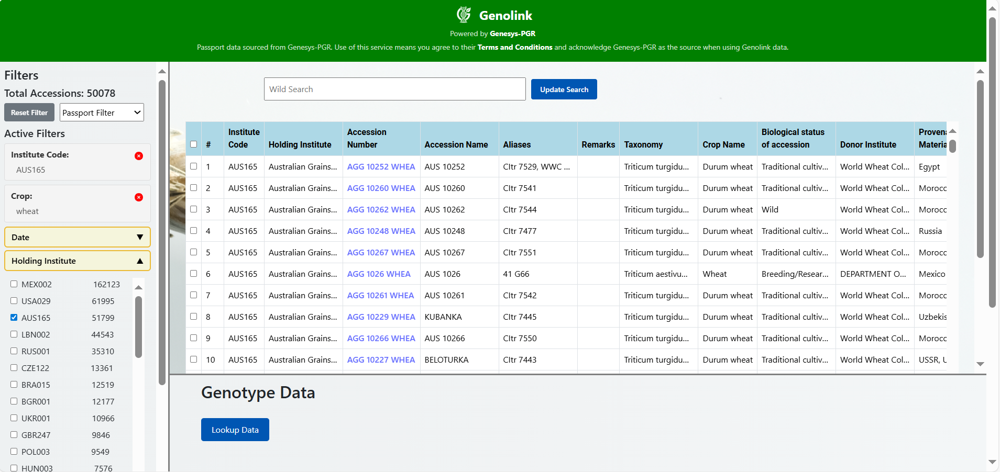

# Genolink

## Searching Genolink

Genolink provides three main ways to search:

- **Genesys-PGR Filters**
  
- **Wild text search** 

- **Accession number Search**

- **GenotypeID search**

- **Filtering for genotyped accessions**

  
   
  <em>Figure 1: Genolink main interface</em>

These options can be combined to refine searches and ensure only relevant accessions are retrieved.

### Applying Genesys-PGR filters
refine search by passport descriptors (date of collection, crop, taxonomy, institute, country of origin, biological status, storage type).

  
   
  <em>Figure 2: Passport Data Filter</em>

### Wild Text Search
The wild text search allows you to query across multiple fields of the passport data.  
you can:  
- Use **double quotes** for exact phrases (e.g., `"rice"`)  
- Use the **OR operator** (`|`) for multiple terms (e.g., `rice | leaf`)  
- Use **asterisks** for prefix searches (e.g., `rice*`)  
- Use **parentheses** for grouping  

The example below shows a query for `rice | leaf`. The search returns records that match either term across different fields, such as accession name, taxonomy, or remarks.  

  
   
  <em>Figure 3: Example results for query <code>rice | leaf</code></em>

### Accession number search
– enter one or multiple accession numbers directly.

  
   
  <em>Figure 4: Accession number search using direct input</em>

– enter multiple accession numbers using a text file.
Please click on browse

  
   
  <em>Figure 5: Accession number search using file upload</em>

Please upload a text file with your list of accessions, with each accession entered on a separate line.

  
   
  <em>Figure 6: Text file format for accession number upload</em>

After the upload, your filter will be applied when you press Search.

  
   
  <em>Figure 7: Search results after uploading accession list</em>

Note: Your file must be a plain text file (.txt).

### GenotypeID search
– The GenotypeID filter works the same way as the Accession Number filter (direct input or file upload).  
Please refer to the *Accession Number Filter* section for detailed steps and examples.  

The only difference is that, in the text file, you must provide a list of **GenotypeIDs** (one per line) instead of accession numbers.

### Filtering for Genotyped Accessions
To restrict results to **genotyped accessions only**, tick the **Check for genotype** checkbox in the filter panel and then press **Search**.  
This will return only those accessions with genotype data available.

  
   
  <em>Figure 8: Filtering results by selecting the ‘Check for genotype’ option</em>

## Requesting genotype data
To request genotype data for your filtered accession records:

1. **Select accessions** from the table by checking the boxes in the first column.  
2. Once selected, the **server(s) containing the genotype data** for those records will be displayed.  
3. You can identify which accessions have genotype data by checking the **AGG-SP Status** column.  
   - Accessions with genotype data show **Status = Completed**.  
   - These records also include a specific **GenotypeID** value.

  
   
  <em>Figure 9: Selecting accessions and identifying genotype data availability</em>

4. After selecting the accessions and clicking **Lookup Data**, a summary will be shown.  
   - It indicates how many of the selected accessions have genotype data in the **Gigwa server**.  
   - It also shows how many of them are registered in the **Genolink internal database**.  
   - The summary lists the **Gigwa datasets** that contain genotype data for those accessions.  

  
   
  <em>Figure 10: Summary showing genotype data availability in Gigwa and internal database</em>

5. After selecting the dataset, you can further refine the genotype data search in two ways:

### Genotype data based on genomic region
- Filter results by specific **chromosomes**  
- Define **genomic positions** (start–end ranges)  

  
   
  <em>Figure 11: Refining genotype data search using chromosome and position filters</em>

### Genotype data based on names of markers
- Filter results using **Variant IDs** that correspond to specific genomic regions.  

  
   
  <em>Figure 12: Refining genotype data search using Variant IDs</em>

### All markers
If you do not apply any of the above filters (chromosome, position, or variant ID),  
Genolink will return genotype results for **all chromosomes and all positions**.  

> **Note:** This may generate very large result sets and could affect performance.  

After configuring your filters (or leaving them empty), click **Search Genotype** to retrieve the results.  
If you want to restart or run a new genotype search with different filters, click the **Reset** button to clear the current selections.

  
   
  <em>Figure 13: Example of genotype search results</em>

### Exporting as a VCF
After retrieving your genotype results, you can select the **server** from which you want to export the data.  
Once the server is chosen, click the **Export VCF** button to download the genotype data in **VCF format**.  

  
   
  <em>Figure 14: Exporting genotype data in VCF format</em>

